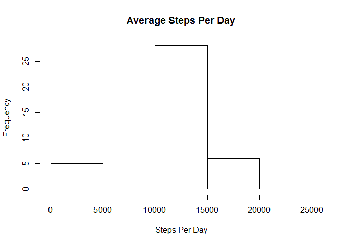

# Reproducible Research: Peer Assessment 1

## Loading and preprocessing the data

Download the file from the internet.


```r
download.file("http://d396qusza40orc.cloudfront.net/repdata%2Fdata%2Factivity.zip", "activity.zip")
```

Unzip the file.


```r
unzip("activity.zip")
```

Load the file.


```r
activity <- read.csv("activity.csv", na.strings="NA")
```


## What is mean total number of steps taken per day?

Calculate the total number of steps per day.


```r
steps <- aggregate(steps ~ date, sum, data=activity, na.action=na.omit)
```

Graph the number of steps per day.


```r
hist(steps$steps, main="Average Steps Per Day", xlab="Steps Per Day")
```

 

Mean of steps per day.


```r
mean(steps$steps)
```

```
## [1] 10766.19
```

Median of steps per day.


```r
median(steps$steps)
```

```
## [1] 10765
```
## What is the average daily activity pattern?


## Imputing missing values


## Are there differences in activity patterns between weekdays and weekends?
